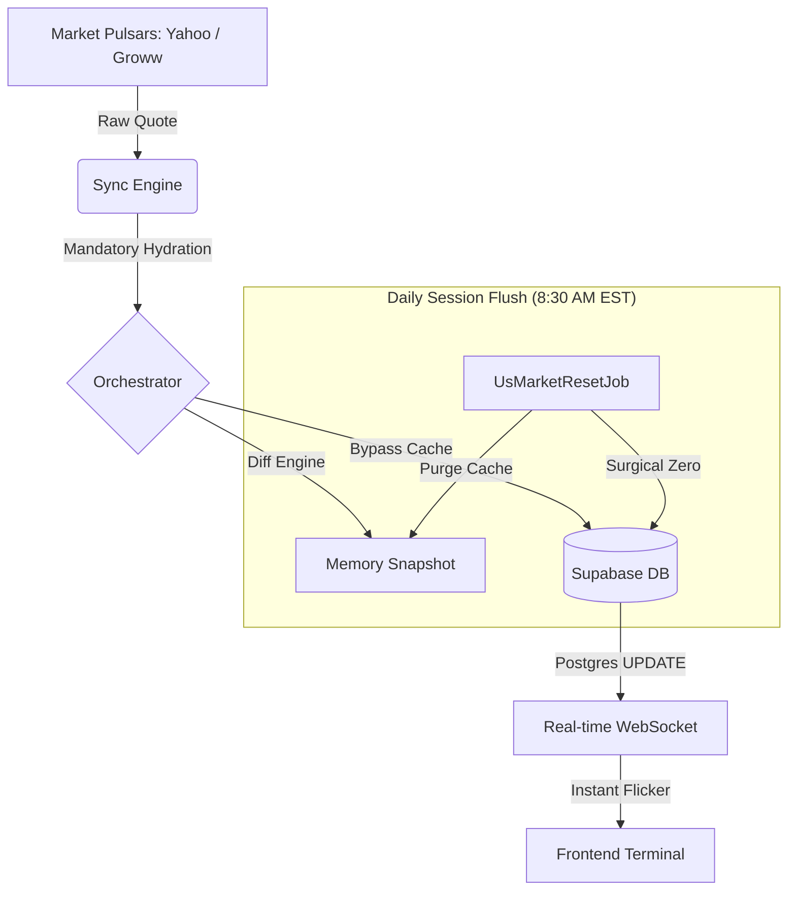

# 📈 StockOS

**An Institutional-Grade Wealth Terminal**

<p align="center">
  <a href="https://stock-os-kappa.vercel.app">
    
  </a>
</p>

StockOS is a production-grade, AI-powered financial terminal designed for high-fidelity market monitoring and portfolio orchestration. Featuring a self-healing data pipeline, multi-source failover architecture, and ultra-low latency real-time synchronization.

---

## ⚡ Real-Time Market Heartbeat

StockOS utilizes a **"Triple-Guard Persistence"** model and WebSocket orchestration to ensure that session boundaries and live quotes are always accurate and synchronized.



### 🏛️ Core Architectural Pillars
- **WebSocket Real-time Sync**: Full instrumentation via Supabase Realtime for instant, zero-reload price and session updates across global markets.
- **Triple-Guard Persistence**: A resilient fallback chain (**Provider > Memory Cache > Database**) ensuring session boundaries (High/Low) are never lost.
- **Automated Session Orchestration**: Surgical market reset at 8:30 AM EST daily, purging stale snapshots for a clean daily session start.
- **Self-Healing Indices**: High-performance proxy handling for **NIFTY 50**, **SENSEX**, and global benchmarks.

---

## ✨ Key Features

### 🛡️ Tactical Research Dossiers
- **Market Pulse Hub**: High-density tactical feed with AI-distilled sector analysis and institutional risk assessments.
- **Institutional Audit**: 78+ point financial audit for every asset, covering everything from PEG Ratios to Dividend Intelligence.
- **Dynamic Performance Hovers**: UI elements react to live stock performance with visual feedback on gains and losses.

### 🎨 Cinematic Terminal UI
- **Glassmorphism Design System**: Ultra-modern, obsidian-dark interface optimized for data-heavy institutional monitoring.
- **Smart Market Routing**: Intelligent asset detection that transitions seamlessly between specialized **US** and **Indian** research dossiers.
- **Stale-While-Revalidate Caching**: Instant-on dashboard loading with background hydration from the live sync engine.

---

## 🛠️ Tech Stack

| Layer | Technology |
|---|---|
| **Framework** | Next.js 14 (App Router) |
| **Database** | Supabase (PostgreSQL + Realtime Replication) |
| **Engine Core** | Node.js + `tsx` (Distributed Job Scheduler) |
| **Styling** | Vanilla CSS + Tailwind CSS |
| **Charts** | TradingView Lightweight Charts + Recharts |
| **AI Insights** | n8n Webhook Proxy + OpenAI |

---

## 📁 Project Blueprint

```bash
StockOS/
├── src/
│   ├── app/            # Next.js App Router (Live Streaming Pages)
│   ├── scheduler/      # THE ENGINE: Job Orchestration & Data Pulsars
│   │   ├── core/       # Sync Logic & Cache Management
│   │   ├── jobs/       # Specialized Tasks (Live, Deep, Reset)
│   │   └── providers/  # Data Proxies (Yahoo, Supabase)
│   ├── services/       # Institutional Logic (DB, Portfolio Bridge)
│   ├── components/     # High-fidelity UI Components
│   └── server.ts       # Production Engine Entry Point
└── public/             # Cinematic Assets & Branding
```

---

## 💎 Acknowledgments & Credits

StockOS is built upon the shoulders of giants. Special thanks to the providers and technologies that power this terminal:

- **Data Pulsars**: Powered by [Yahoo Finance](https://finance.yahoo.com/) and [Groww](https://groww.in/).
- **Database Architecture**: Built on [Supabase](https://supabase.com/) for its incredible PostgreSQL Realtime engine.
- **AI Insights**: Research distilling powered by [OpenAI](https://openai.com/) and orchestrated via [n8n](https://n8n.io/).
- **Visual Intelligence**: Charts rendered using [TradingView](https://www.tradingview.com/lightweight-charts/).
- **Design Inspiration**: Drawing from institutional terminals like Bloomberg and Reuters.

---

Built with ❤️ by Vaibhav