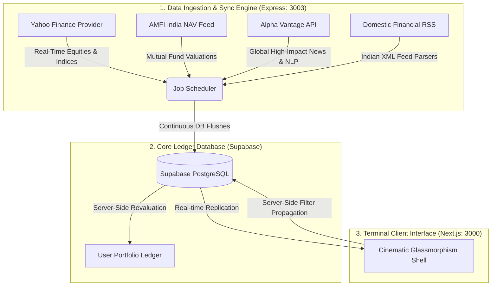

# StockOS

**An AI-Powered Institutional Wealth Terminal & Market Intelligence Platform**

StockOS is a production-grade financial terminal designed for real-time portfolio orchestration, multi-asset wealth tracking, and automated market intelligence feeds. Built with a self-healing background data pipeline, server-side portfolio revaluation, and an AI-driven global/domestic news sentiment stream, StockOS delivers a zero-lag, data-dense Bloomberg-style dashboard for modern investors.

---

## Technical Architecture

StockOS operates on a split-engine architecture consisting of a high-performance background sync engine and a Next.js server-side web interface, communicating through Supabase replication.



---

## Holistic Feature Map

### 1. Wealth & Portfolio Orchestration (Dashboard)
* **Unified Asset Ledger**: Active monitoring of global equities (US), domestic equities (India), and Indian Mutual Funds in a single, high-density spreadsheet-style terminal interface.
* **Continuous Portfolio Revaluation**: Automatically calculates daily and absolute profit/losses (P/L), net asset values (NAV), average buy prices, current valuations, and daily percentage changes.
* **Institutional CAS & Excel Upload Bridge**: Supports zero-effort onboarding via automated parsing of Consolidated Account Statements (CAS) and portfolio Excel sheets, matching ISINs, schemes, transactions, and holdings schemas instantly.
* **Mutual Fund Analytics Suite**: Displays structural information for over 10,000+ mutual fund schemes, detailing returns (1Y, 3Y, 5Y), expense ratios, AUM, portfolio allocations, credit ratings, top stock holdings, and fund manager profiles.

### 2. Market Intelligence & Sentiment Engine (Journal)
* **NLP-Driven Sentiment Stream**: Gathers daily news articles, running them through natural language processing to extract sentiment scores (Bullish, Bearish, Neutral) and sector relevance weights.
* **Database-Level Query Propagation**: Propagates all active search queries, sentiment filters, and stock focus selections directly to database-indexed columns, instantly retrieving the top 30 filtered matches and maintaining context through infinite scrolling.
* **Market Index Constellations**: Sidebar HUD maps the full index components dynamically:
  - **India News**: Populates and tracks the full **NIFTY 50** index constituents.
  - **Global News**: Populates and tracks the full **DOW 30** index constituents.
  - **Saved Articles**: Dynamic real-time extraction showing ONLY the tickers actively mentioned in your bookmarked articles.

### 3. Bulletproof Engineering & Optimizations
* **Router State Safeguards**: Utilizes a custom React `useRef` event anchor (`openingArticleId`) that acts as a lock. This prevents Next.js shallow URL parameter routing from causing race conditions, deselecting states, or collapsing active side panels during page hydration.
* **Server-Side Summary HUD**: Replaces heavy client-side analytics processing with server-side calendar-month aggregate queries, updating sentiment gauges, macro topic indexes, and active counts with sub-millisecond response times.

---

## Tech Stack

| Layer | Technology |
|---|---|
| **Frontend Shell** | Next.js 14 (App Router, Tailwind CSS, Framer Motion, Lucide icons) |
| **Backend Core** | Node.js + Express (Distributed Job Scheduler, AMFI parser, `tsx`) |
| **Database** | Supabase (PostgreSQL + Real-time Replication + pgVector) |
| **Data Pulsars** | Yahoo Finance Provider, AMFI NAV Feeds, Alpha Vantage NLP |
| **Visual Analytics** | TradingView Lightweight Charts + Recharts |

---

## Project Structure

```bash
StockOS/
├── src/
│   ├── app/            # Next.js App Router (Dashboard, Journal, Mutual Funds, Stocks)
│   ├── scheduler/      # Core Data Orchestrator & Distributed Job Scheduler
│   │   ├── core/       # Sync coordinator, sync logs, and recovery systems
│   │   ├── jobs/       # Live Syncs, Deep Seeding, Portfolio Revaluation
│   │   └── providers/  # Yahoo Finance & AMFI India proxies
│   ├── services/       # CAS statement imports, Excel parsers, DB bridges
│   ├── components/     # Cinematic Glassmorphism UI components, layouts, & portals
│   └── server.ts       # Production Engine Entry Point
├── package.json        # Unified scripts and project dependencies
└── README.md           # Terminal Documentation
```

## Acknowledgments & Credits

StockOS is built upon the shoulders of giants. Special thanks to the providers and technologies that power this terminal:

- **Data Pulsars**: Powered by [Yahoo Finance](https://finance.yahoo.com/) and [Groww](https://groww.in/).
- **Database Architecture**: Built on [Supabase](https://supabase.com/) for its incredible PostgreSQL Realtime engine.
- **AI Insights**: Research sentiment and topic intelligence parsed directly from the [Alpha Vantage News API](https://www.alphavantage.co/) NLP engine.
- **Visual Intelligence**: Charts rendered using [TradingView](https://www.tradingview.com/lightweight-charts/).
- **Design Inspiration**: Drawing from institutional terminals like Bloomberg and Reuters.

---

Please ⭐ The Repo If You Find It Useful! :)