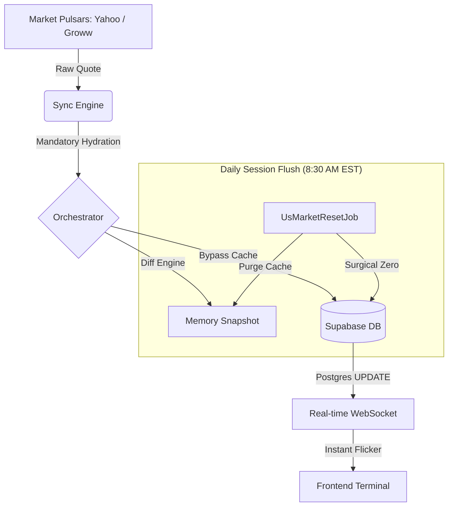
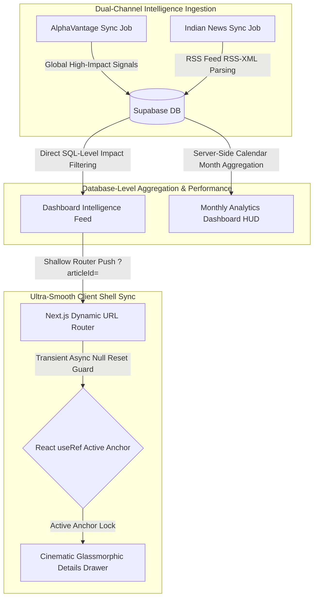

# StockOS

**An Institutional-Grade Wealth Terminal**

<p align="center">
  <a href="https://stock-os-kappa.vercel.app">
    
  </a>
</p>

StockOS is a production-grade, AI-powered financial terminal designed for high-fidelity market monitoring and portfolio orchestration. Featuring a self-healing data pipeline, multi-source failover architecture, and ultra-low latency real-time synchronization.

---

## Real-Time Market Heartbeat

StockOS utilizes a **"Triple-Guard Persistence"** model and WebSocket orchestration to ensure that session boundaries and live quotes are always accurate and synchronized.



### Core Architectural Pillars
- **WebSocket Real-time Sync**: Full instrumentation via Supabase Realtime for instant, zero-reload price and session updates across global markets.
- **Triple-Guard Persistence**: A resilient fallback chain (**Provider > Memory Cache > Database**) ensuring session boundaries (High/Low) are never lost.
- **Automated Session Orchestration**: Surgical market reset at 8:30 AM EST daily, purging stale snapshots for a clean daily session start.
- **Self-Healing Indices**: High-performance proxy handling for **NIFTY 50**, **SENSEX**, and global benchmarks.

---

## Advanced Core Engineering Upgrades

StockOS features highly robust, institutional-grade upgrades designed to ingest, process, and present real-time intelligence feeds with maximum fault-tolerance.



### 1. Dual-Channel News Sync & Database Filtering
* **Background Orchestration**: Scheduled background jobs (`AlphaVantageNewsSyncJob` and `IndianNewsSyncJob`) poll and sync global and domestic financial news every 2 hours under Lowest-Priority (P5) queueing.
* **SQL-Level Filtering**: Leverages high-performance PostgreSQL-level `impact` and `sentiment` indexing on the database to query up to 300 highly-curated daily signals, delivering complete, non-truncated market intelligence.

### 2. Server-Side Multi-Month Analytics
* **Broad Scope Calculations**: Replaces performance-heavy client-side pagination computations with server-side calendar-month aggregate queries.
* **Zero-Lag Loading**: Instant analytics HUD updates (aggregate sentiment score, topic density breakdowns, active tickers counts) derived via optimized backend database indexes across thousands of live monthly articles.

### 3. Router Race-Condition Neutralization
* **Asynchronous State Buffering**: Eliminates shallow Next.js router transition race-conditions.
* **Ref-Based Event Guarding**: Introduces a React `useRef` event guard (`openingArticleId`) that acts as an active anchor lock. This prevents transient asynchronous URL parameter fluctuations from resetting state or collapsing active terminal viewports during page hydration or side-panel opening.

---

## Key Features

### Tactical Research Dossiers
- **Market Pulse Hub**: High-density tactical feed with AI-distilled sector analysis and institutional risk assessments.
- **Institutional Audit**: 78+ point financial audit for every asset, covering everything from PEG Ratios to Dividend Intelligence.
- **Dynamic Performance Hovers**: UI elements react to live stock performance with visual feedback on gains and losses.

### Cinematic Terminal UI
- **Glassmorphism Design System**: Ultra-modern, obsidian-dark interface optimized for data-heavy institutional monitoring.
- **Smart Market Routing**: Intelligent asset detection that transitions seamlessly between specialized **US** and **Indian** research dossiers.
- **Stale-While-Revalidate Caching**: Instant-on dashboard loading with background hydration from the live sync engine.

---

## Tech Stack

| Layer | Technology |
|---|---|
| **Framework** | Next.js 14 (App Router) |
| **Database** | Supabase (PostgreSQL + Realtime Replication) |
| **Engine Core** | Node.js + `tsx` (Distributed Job Scheduler) |
| **Styling** | Vanilla CSS + Tailwind CSS |
| **Charts** | TradingView Lightweight Charts + Recharts |
| **AI Insights** | Alpha Vantage NLP Engine |

---

## Project Blueprint

```bash
StockOS/
├── src/
│   ├── app/            # Next.js App Router (Live Streaming Pages)
│   ├── scheduler/      # THE ENGINE: Job Orchestration & Data Pulsars
│   │   ├── core/       # Sync Logic & Cache Management
│   │   ├── jobs/       # Specialized Tasks (Live, Deep, Reset)
│   │   └── providers/  # Data Proxies (Yahoo, Supabase)
│   ├── services/       # Institutional Logic (DB, Portfolio Bridge)
│   ├── components/     # High-fidelity UI Components
│   └── server.ts       # Production Engine Entry Point
└── public/             # Cinematic Assets & Branding
```

---

## Acknowledgments & Credits

StockOS is built upon the shoulders of giants. Special thanks to the providers and technologies that power this terminal:

- **Data Pulsars**: Powered by [Yahoo Finance](https://finance.yahoo.com/) and [Groww](https://groww.in/).
- **Database Architecture**: Built on [Supabase](https://supabase.com/) for its incredible PostgreSQL Realtime engine.
- **AI Insights**: Research sentiment and topic intelligence parsed directly from the [Alpha Vantage News API](https://www.alphavantage.co/) NLP engine.
- **Visual Intelligence**: Charts rendered using [TradingView](https://www.tradingview.com/lightweight-charts/).
- **Design Inspiration**: Drawing from institutional terminals like Bloomberg and Reuters.

---

Built with love by Vaibhav