# StockOS

> **A premium financial operating system for serious investors.**

StockOS unifies Indian equities, US stocks, and mutual funds into one intelligent dashboard — built on a split-engine architecture, a RAM-first real-time sync engine, institutional-grade portfolio analytics, and an AI research assistant backed by an n8n RAG pipeline.

---

## Table of Contents

- [Architecture Overview](#architecture-overview)
- [Pulse Engine — How Sync Works](#pulse-engine--how-sync-works)
- [Job Scheduler](#job-scheduler--the-orchestration-layer)
- [Market Session Detection](#market-session-detection)
- [Active Registry — Symbol Universe](#active-registry--symbol-universe-management)
- [Portfolio Import System](#portfolio-import-system)
- [AI Research Assistant & n8n RAG Pipeline](#ai-research-assistant--n8n-rag-pipeline)
- [News Intelligence Engine](#news-intelligence-engine)
- [Database Schema](#database-schema)
- [Authentication](#authentication)
- [UI Architecture](#ui-architecture)
- [Pages & Routes](#pages--routes)
- [Key Engineering Decisions](#key-engineering-decisions)
- [Tech Stack](#tech-stack)
- [Environment Variables](#environment-variables)
- [Local Development](#local-development)
- [Project Structure](#project-structure)

---

## Architecture Overview

StockOS runs two concurrent processes — a Next.js frontend and a standalone Express sync engine — communicating through a shared Supabase PostgreSQL database.

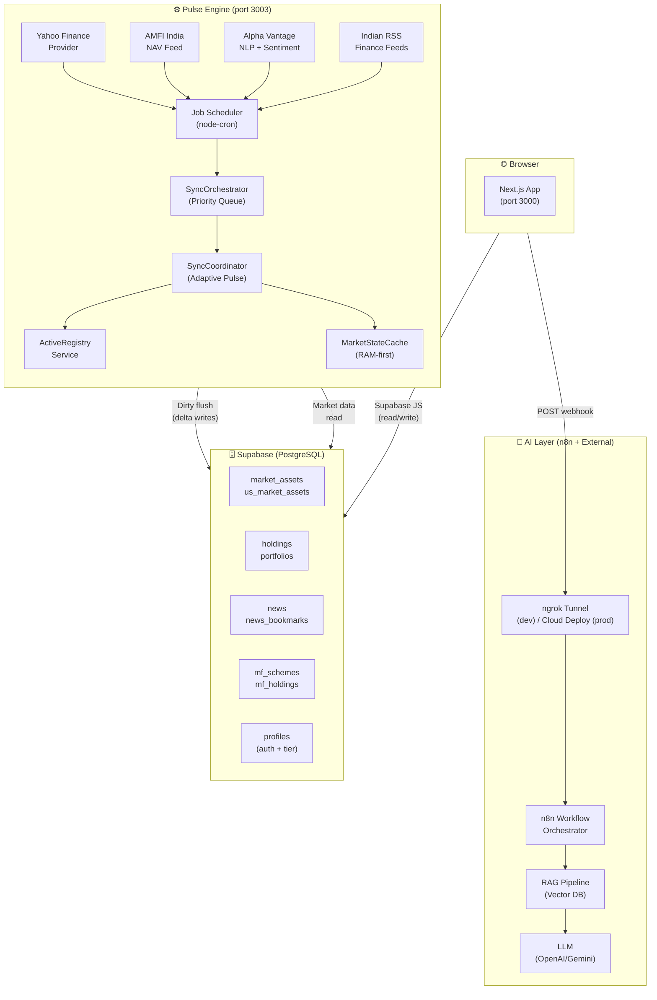

```
npm run dev
  └── concurrently
        ├── next dev -p 3000     → Frontend (Next.js App Router)
        └── tsx --watch src/server.ts → Pulse Engine (Express + Scheduler)
```

---

## Pulse Engine — How Sync Works

The Pulse Engine is a long-running Express server (`src/server.ts`) that boots a full job scheduler and an **adaptive heartbeat loop** on startup.

### Boot Sequence

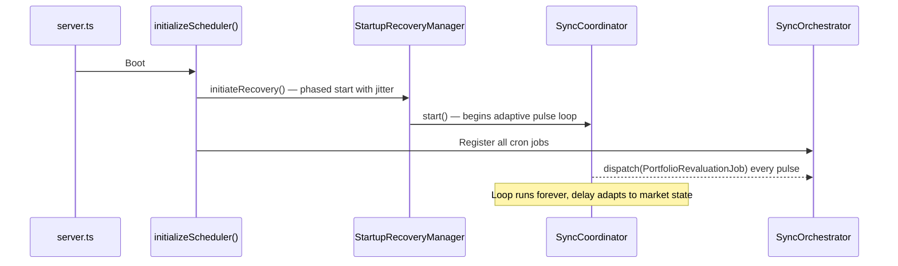

### Adaptive Pulse Timing

The `SyncCoordinator` does not use a fixed interval. It reads live market state and user demand every cycle:

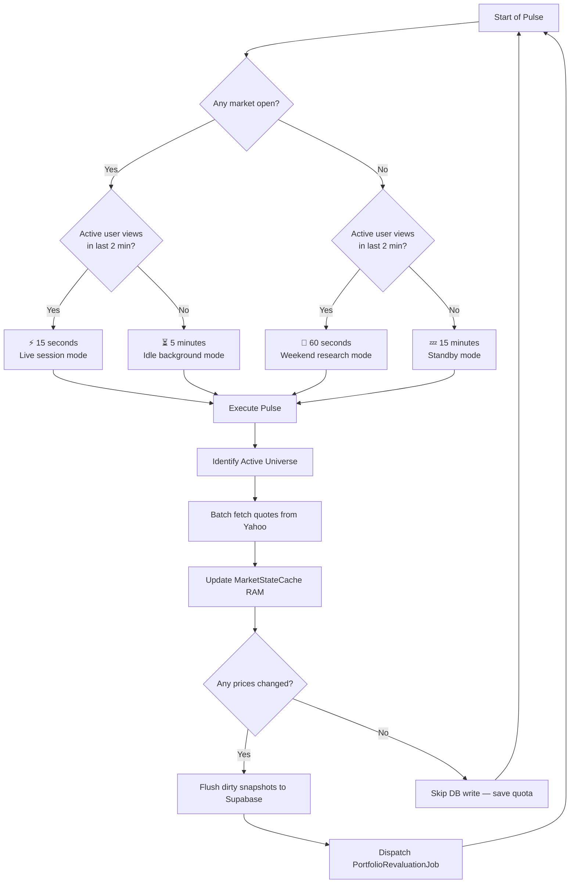

### RAM-First Architecture (MarketStateCache)

All live price data is held in **RAM first** using a singleton `MarketStateCache`:

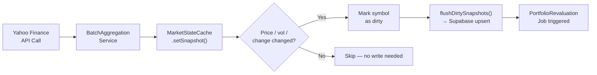

| Cache Feature | Description |
|---|---|
| **Snapshot store** | `symbol → { price, change, changePercent, volume, high, low, prevClose }` |
| **Dirty flags** | Only symbols with changed values are flushed to Supabase |
| **Inflight coalescing** | If 2 workers request the same symbol, only 1 HTTP call fires |
| **Heartbeat tracking** | Records `symbol → timestamp` of last browser view (drives EPHEMERAL state) |
| **Write savings** | ~60–80% reduction in Supabase writes during flat market periods |

---

## Job Scheduler — The Orchestration Layer

All background work is dispatched through `SyncOrchestrator`, an in-memory priority queue that simulates BullMQ without Redis.

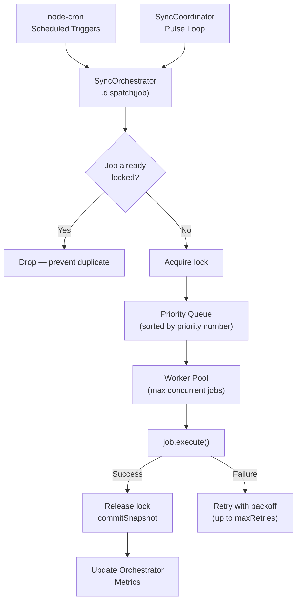

### Job Priority Tiers

| Priority | Job | Trigger | Purpose |
|---|---|---|---|
| **1** | `IndianLiveSyncJob` | Every pulse (during market hours) | Real-time Indian equity quotes |
| **1** | `UsLiveSyncJob` | Every pulse (during market hours) | Real-time US equity quotes |
| **2** | `PortfolioRevaluationJob` | Every 3h + after every price flush | Recalculate all holdings P&L |
| **3** | `IndianDeepSyncJob` | Daily 3:45 PM IST | Post-market Indian deep data |
| **3** | `UsDeepSyncJob` | Daily 4:15 PM EST | Post-market US deep data |
| **3** | `IndianAnalyticsSyncJob` | Daily 4:00 PM IST | Moving averages, volume analytics |
| **3** | `UsAnalyticsSyncJob` | Daily 5:00 PM EST | US analytics settlement |
| **3** | `MFPortfolioRevaluationJob` | After AMFI NAV updates | Revalue all MF holdings |
| **4** | `MutualFundSyncJob` (AMFI) | Nightly 11:30–11:45 PM IST (4 runs) | Ingest daily NAVs from AMFI |
| **5** | `AlphaVantageNewsSyncJob` | Every 3 hours | Global news + NLP sentiment |
| **5** | `IndianNewsSyncJob` | Every 3 hours | Indian RSS finance feeds |
| **5** | `IndianMasterSeedJob` | Weekly Sunday 1:00 AM IST | Discover new Indian symbols |
| **5** | `MFMasterSeedJob` | Weekly Sunday 2:00 AM IST | Discover new MF schemes (10,000+) |

### Orchestrator Live Metrics

The orchestrator exposes real-time metrics via the Engine API:

| Metric | Meaning |
|---|---|
| `pendingCount` / `runningCount` | Queue depth |
| `skippedWrites` | Dirty-check hits (saved DB writes) |
| `avgPayloadReductionPct` | % of fields stripped before upsert |
| `avgQueueLagMs` | Time from dispatch → execution start |
| `dirtyCheckHits` / `Misses` | RAM cache efficiency ratio |

---

## Market Session Detection

`MarketStatusEngine` uses **DST-aware IANA timezone parsing** to determine exact market state:

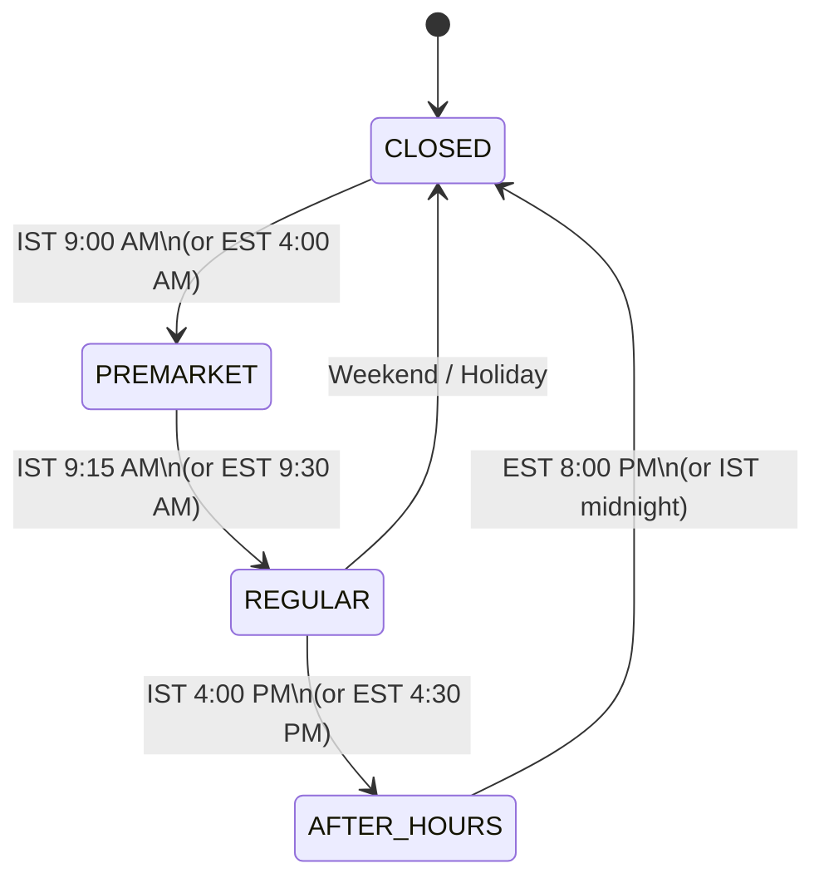

| Region | Pre-market | Regular session | After-hours |
|---|---|---|---|
| **India (NSE/BSE)** | 9:00–9:15 AM IST | 9:15 AM–4:00 PM IST | — |
| **US (NYSE/NASDAQ)** | 4:00–9:30 AM EST | 9:30 AM–4:30 PM EST | 4:30–8:00 PM EST |

Both regions also handle weekends, national holidays, and early-close days explicitly.

---

## Active Registry — Symbol Universe Management

`ActiveRegistryService` resolves **which symbols need live data** at any given moment:

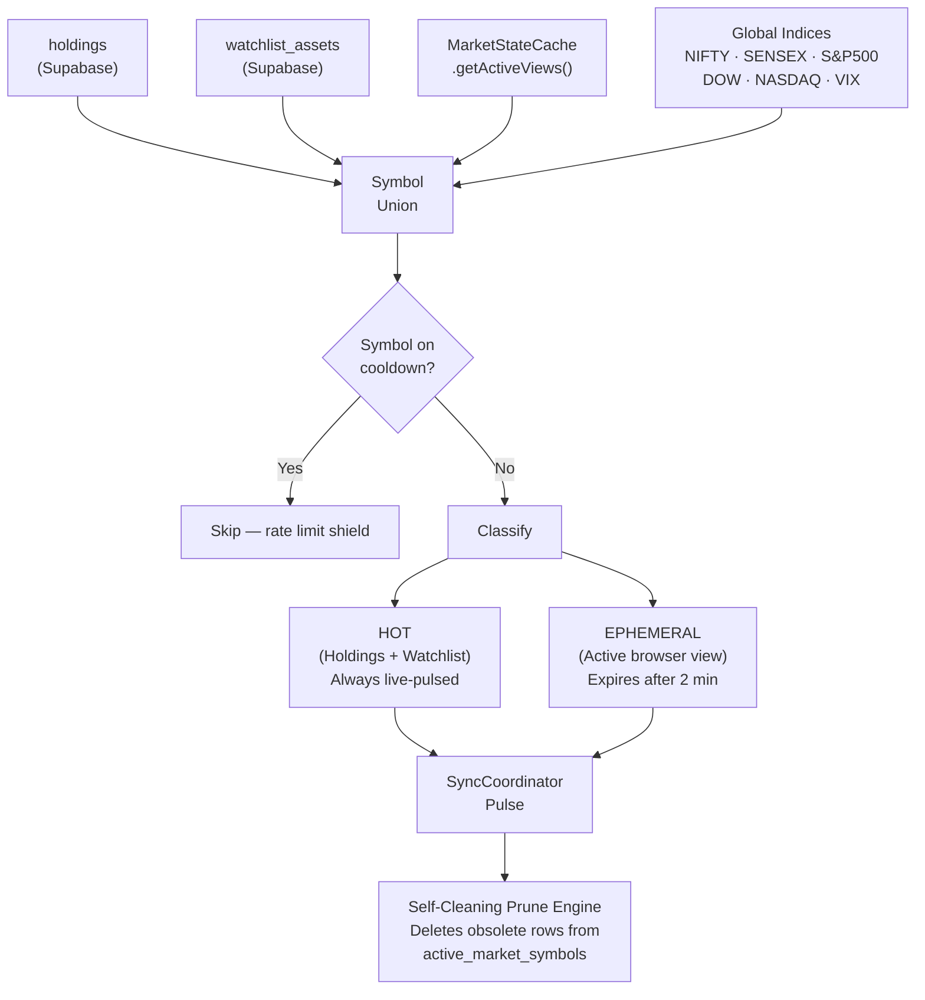

| Symbol State | Source | TTL |
|---|---|---|
| **HOT** | `holdings` + `watchlist_assets` DB tables | Permanent (while holding exists) |
| **EPHEMERAL** | Client heartbeat from stock detail page | 2 minutes after last heartbeat |
| **INDEX** | `SymbolUniverseManager.getGlobalIndices()` | Always included |

---

## Portfolio Import System

StockOS supports three zero-effort import methods for real broker data:

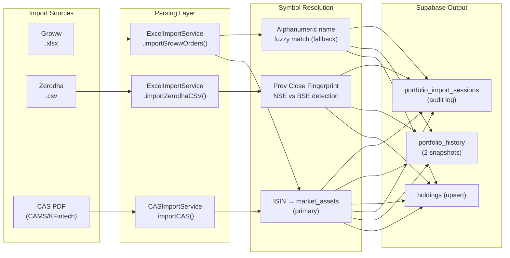

### Groww Excel Import
- Extracts: `Stock Name`, `ISIN`, `Quantity`, `Average buy price`, `Buy value`, `Closing price`
- Resolution order: **ISIN → name fuzzy match → fallback `.NS` symbol**
- Generates **deterministic UUIDs** via `MD5(portfolio_id + symbol)` — re-import is always safe (idempotent)
- Writes two `portfolio_history` snapshots: statement date (historical baseline) + today (live revaluation)

### Zerodha CSV Import
- Parses: `Instrument`, `Qty.`, `Avg. cost`, `LTP`, `Day chg.`
- Uses **Prev Close Fingerprinting** to detect exchange:
  - Calculates `impliedPrevClose = LTP / (1 + dayChg%)` from the broker file
  - Compares against both `.NS` and `.BO` entries in `market_assets`
  - Picks the exchange whose `prev_close` is numerically closest → zero manual configuration needed

### CAS PDF Import (CAMS / KFintech)
- Accepts password-protected MF statements
- Decrypts with `pdf-parse` using the user-supplied password
- Parses: ISIN, scheme name, folio number, quantity, average NAV, invested value, market value
- Creates audit entry in `portfolio_import_sessions` (`PENDING → COMPLETED | FAILED`)

---

## AI Research Assistant & n8n RAG Pipeline

The **Floating Research Assistant** is a fully production-ready AI chat interface embedded in the StockOS dashboard, powered by a complete **n8n RAG pipeline** connected via a live webhook. The entire workflow — embedding, retrieval, context assembly, and LLM call — is built and running in n8n.

### Architecture

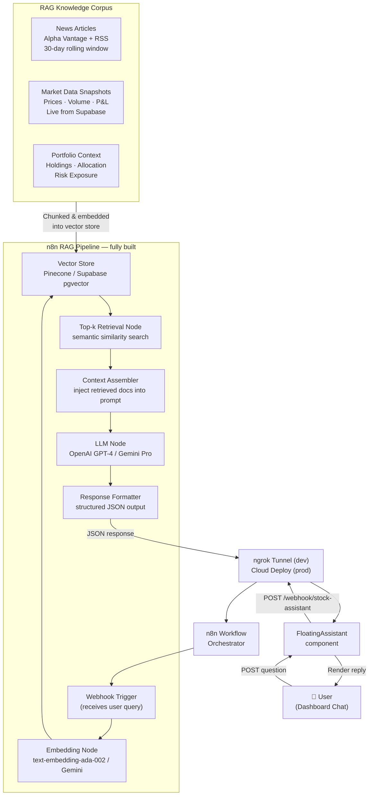

### Query Lifecycle

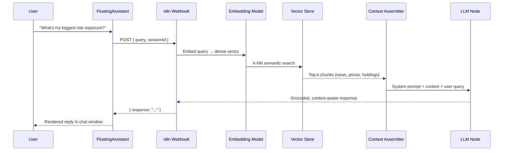

### RAG Knowledge Corpus

The vector store is continuously populated from three live sources inside StockOS:

| Source | Content ingested | Update cadence |
|---|---|---|
| `news` table (Alpha Vantage + RSS) | Articles with sentiment labels, ticker tags, summaries | Every 3 hours |
| `market_assets` / `us_market_assets` | Live prices, volume, day change, prev close | Every pulse cycle (15s–15m) |
| `holdings` + `portfolio_history` | Allocation, invested value, P&L, historical wealth curve | After every revaluation job |

### System Properties

| Property | Detail |
|---|---|
| **Status** | Fully built and operational in n8n |
| **Transport** | HTTP POST webhook — stateless, works behind any reverse proxy |
| **Dev tunnel** | `ngrok` exposes local n8n to `NEXT_PUBLIC_STOCK_ASSISTANT` |
| **Production** | n8n deployed to cloud server; env var points to cloud webhook URL |
| **Embedding model** | OpenAI `text-embedding-ada-002` / Gemini Embedding |
| **Vector store** | Supabase `pgvector` or Pinecone (configurable in n8n retrieval node) |
| **LLM** | OpenAI GPT-4 / Gemini Pro — swappable inside n8n with zero app code changes |
| **Retrieval strategy** | Top-k semantic similarity with configurable relevance score threshold |
| **Context injection** | Retrieved chunks assembled into system prompt before LLM generation |
| **Knowledge window** | 30-day rolling news corpus + live market snapshots + user portfolio state |
| **Frontend wiring** | `NEXT_PUBLIC_STOCK_ASSISTANT` env var — swap URL to switch dev/prod environments |

---

## News Intelligence Engine

The news system ingests from two parallel sources every 3 hours:

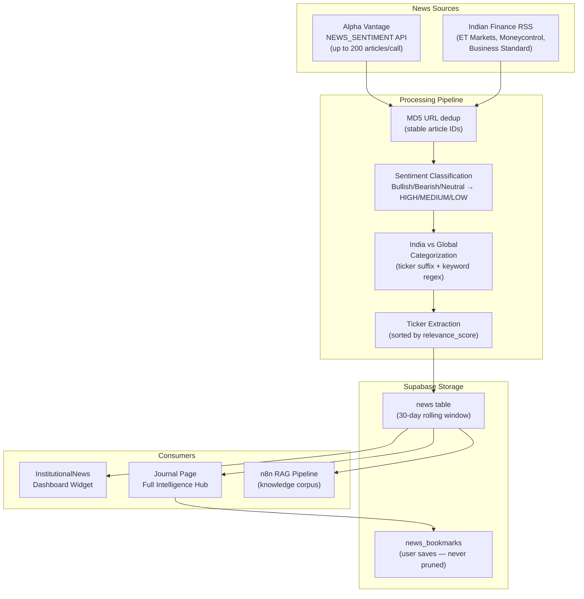

### Alpha Vantage Sentiment Mapping

| AV Label | StockOS Impact | Usage |
|---|---|---|
| `Bullish` / `Bearish` | `HIGH` | Shown in dashboard widget |
| `Somewhat-Bullish` / `Somewhat-Bearish` | `MEDIUM` | Shown in journal |
| `Neutral` | `LOW` | Filtered out of dashboard |

### India Detection Logic
Articles are tagged `india` if they contain:
- An Indian exchange ticker suffix (`.NS`, `.BO`, `.BSE`)
- A topic matching `india`
- Keywords: `nifty`, `sensex`, `nse`, `bse`, `rupee`, `rbi`, `sebi`, `reserve bank`

### Pruning Policy
- Articles older than **30 days** are automatically deleted
- Articles saved in `news_bookmarks` by any user are **permanently protected** from pruning

---

## Database Schema

```mermaid
erDiagram
    profiles {
        uuid id PK
        text email
        text full_name
        text avatar_url
        text subscription_tier
        timestamp updated_at
    }
    portfolios {
        uuid id PK
        uuid user_id FK
        text name
        text type
        timestamp created_at
    }
    holdings {
        uuid id PK
        uuid user_id FK
        uuid portfolio_id FK
        text trading_symbol
        numeric quantity
        numeric average_price
        numeric last_price
        numeric invested_value
        numeric market_value
        numeric p_l
        numeric day_change
        text broker_name
    }
    portfolio_history {
        uuid id PK
        uuid portfolio_id FK
        timestamp timestamp
        numeric total_investment
        numeric total_market_value
        numeric total_p_l
        numeric p_l_percentage
    }
    market_assets {
        text symbol PK
        text name
        text isin
        numeric current_price
        numeric day_change
        numeric day_change_percentage
        numeric prev_close
        numeric volume
        timestamp updated_at
    }
    watchlist_assets {
        uuid id PK
        uuid user_id FK
        text symbol
        text name
    }
    news {
        text id PK
        text title
        text summary
        text url
        text category
        text impact
        text sentiment_label
        numeric sentiment_score
        text[] stocks
        timestamp published_at
    }
    mf_holdings {
        uuid id PK
        uuid user_id FK
        text isin
        text scheme_name
        numeric quantity
        numeric average_price
        numeric current_nav
    }

    profiles ||--o{ portfolios : owns
    portfolios ||--o{ holdings : contains
    portfolios ||--o{ portfolio_history : tracks
    profiles ||--o{ watchlist_assets : watches
    profiles ||--o{ mf_holdings : holds
```

### Full Table Reference

| Table | Purpose |
|---|---|
| `profiles` | User accounts, Google OAuth data, subscription tier |
| `portfolios` | Named portfolio containers (equity or MF type) |
| `holdings` | Individual stock positions with live P&L |
| `portfolio_history` | Daily wealth snapshots powering the performance chart |
| `market_assets` | Indian equity price data (NSE/BSE) |
| `us_market_assets` | US equity price data |
| `active_market_symbols` | Live sync registry (HOT/EPHEMERAL state) |
| `watchlist_assets` | User-curated watchlist entries |
| `mf_schemes` | 10,000+ mutual fund scheme metadata from AMFI |
| `mf_holdings` | User MF positions imported from CAS statements |
| `mf_nav_history` | Daily NAV history per scheme |
| `news` | Intelligence feed (Alpha Vantage + Indian RSS) |
| `news_bookmarks` | User-saved articles (protected from pruning) |
| `portfolio_import_sessions` | Audit log for every import operation |
| `reviews` | User review submissions |

---

## Authentication

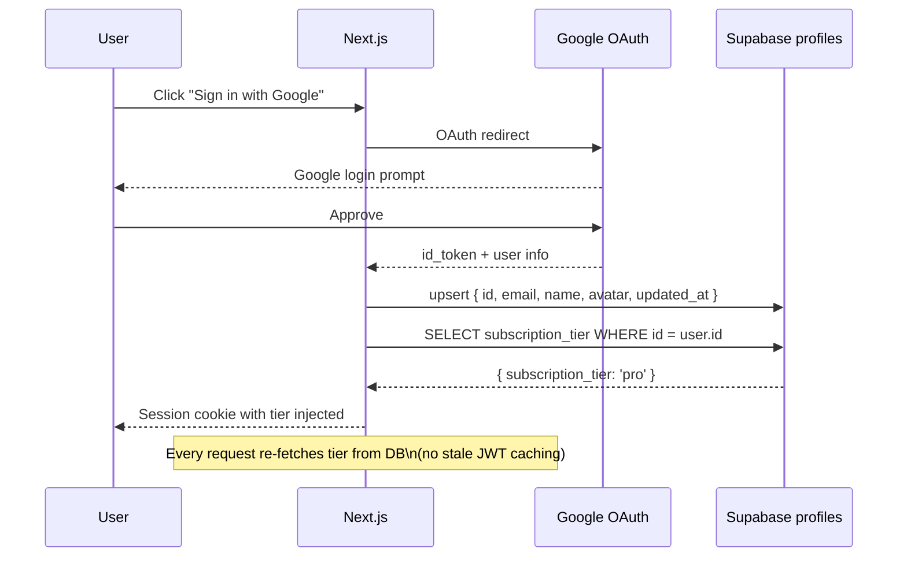

- **Provider**: NextAuth v4 with Google OAuth
- **`signIn` callback**: Upserts `profiles` row on every login (idempotent)
- **`session` callback**: Reads `subscription_tier` from DB on every session refresh — always fresh
- **Middleware** (`src/middleware.ts`): Redirects unauthenticated users to `/auth/login`

---

## UI Architecture

### Visual Design System

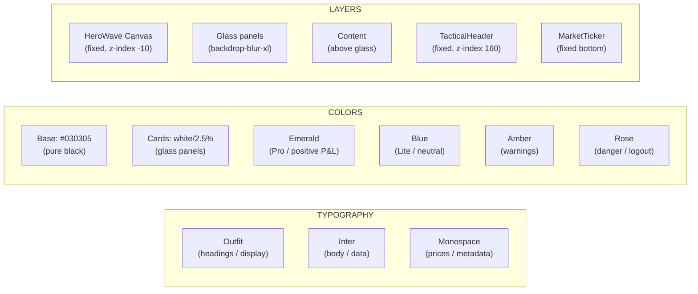

### HeroWave Background Shader

The animated canvas background runs on every page via the root layout:

- **Rendering**: Raw Canvas 2D, rendering at `1/4 resolution` then upscaled with `imageSmoothingEnabled` for performance
- **Math**: Fast LUT sin/cos tables (1024-entry Float32Arrays) replace `Math.sin()` calls
- **Adaptive speed**: Wave speed transitions smoothly based on pathname — faster on `/`, slower on inner pages
- **Frame skip**: Only writes to canvas every **2nd frame** to halve GPU load
- **Intro shader**: `BackgroundShader.tsx` uses Three.js WebGL light beams that fade out as the HeroWave becomes visible

### Key Shared Components

| Component | Description |
|---|---|
| `TacticalHeader` | Fixed nav — animated pill tabs (Framer Motion `layoutId`), universal market search modal, profile dropdown with live tier badge |
| `MarketTicker` | Bottom horizontal live index strip — NIFTY, SENSEX, BANK NIFTY, S&P 500, DOW, NASDAQ, VIX, USD/INR |
| `HeroWave` | Canvas-based animated background (runs globally via root layout) |
| `BackgroundShader` | Three.js WebGL intro shader (fades into HeroWave) |
| `MarketSearch` | Full-screen search modal with debounced live results |
| `WealthPerformanceChart` | TradingView Lightweight Charts area chart — total wealth over time |
| `PortfolioAnalyzer` | AI-powered equity holdings analysis — sector, risk, attribution |
| `MFPortfolioAnalyzer` | Mutual fund analyzer — category breakdown, AMC allocation, performance |
| `WatchlistTerminal` | Dense live watchlist with real-time price updates and sparklines |
| `InstitutionalNews` | News widget with sentiment tags, live refresh every 5 min |
| `FloatingAssistant` | AI research chat panel (POST → n8n webhook) |
| `RollingNumber` | Animated number counter with spring physics |
| `AssetLogo` | Company / fund logo resolver with fallback initials |
| `MiniSparkline` | Inline 7-day price sparklines |

---

## Pages & Routes

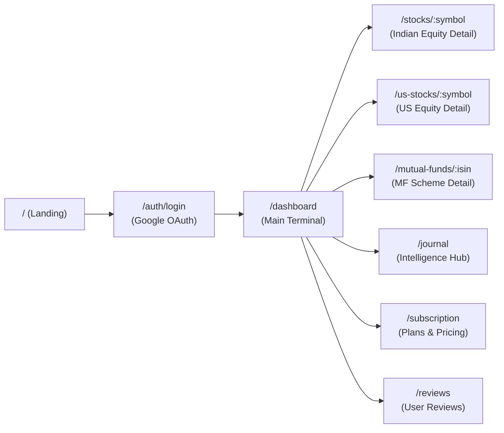

| Route | Description |
|---|---|
| `/` | Landing page with animated hero and HeroWave |
| `/dashboard` | Main wealth terminal — portfolios, holdings, charts, news, watchlist |
| `/stocks` | Indian equity market browser |
| `/stocks/:symbol` | Live Indian stock detail with chart and analytics |
| `/us-stocks` | US equity market browser |
| `/us-stocks/:symbol` | Live US stock detail |
| `/mutual-funds` | MF universe browser (10,000+ schemes) |
| `/mutual-funds/:isin` | Individual scheme detail — NAV, returns, analytics |
| `/journal` | Full news intelligence hub with sentiment analysis |
| `/subscription` | Pricing page — Free / Lite / Pro |
| `/reviews` | User reviews with Supabase-backed submission |
| `/auth/login` | Google OAuth sign-in |

---

## Data Flow — End to End

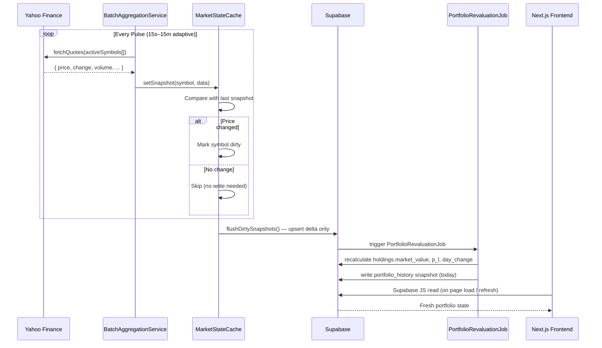

---

## Key Engineering Decisions

### Why a split engine instead of Next.js API routes?
API routes are stateless and serverless — they cannot hold in-memory state, run persistent loops, or maintain scheduled jobs. The Pulse Engine runs as a separate long-lived process, enabling the `MarketStateCache` singleton, priority queue, and adaptive pulse timing to persist across cycles.

### Why RAM-first with dirty-flag flushing?
Market data pulses every 15 seconds. Writing every symbol on every pulse would exhaust Supabase's free-tier write limits within minutes. By holding data in RAM and only flushing **changed** snapshots, we reduce writes by 60–80% during flat market periods.

### Why deterministic UUIDs for holdings?
Using `MD5(portfolio_id + symbol)` as the holding ID means re-importing the same portfolio always hits an `upsert` — never a duplicate insert. The import workflow is fully idempotent.

### Why adaptive pulse timing?
Polling at 15s when no users are online wastes API quota. By reading `MarketStateCache.getActiveViews()`, the engine knows if any browser is actively viewing a stock detail page. If not, it backs off automatically to 5m or 15m.

### Why n8n for the AI assistant?
n8n provides a visual, self-hostable workflow engine that makes it easy to swap between LLM providers (OpenAI, Gemini), update the RAG retrieval strategy, or inject new data sources into the knowledge corpus — without touching the frontend code. The webhook interface keeps the AI pipeline fully decoupled.

### Why Prev Close Fingerprinting for Zerodha?
Zerodha exports don't specify the exchange (NSE vs BSE). The fingerprint approach — calculating `impliedPrevClose = LTP / (1 + dayChg%)` and matching it against both exchanges' stored prev_close values — gives a deterministic, data-driven exchange assignment with zero user input.

---

## Tech Stack

| Layer | Technology | Version |
|---|---|---|
| **Frontend** | Next.js (App Router) | 14.1.0 |
| **Styling** | Tailwind CSS | ^3.3 |
| **Animations** | Framer Motion | ^11 |
| **3D / WebGL** | Three.js | ^0.160 |
| **Charts** | Lightweight Charts (TradingView) | ^5.2 |
| **Charts (MF/Analytics)** | Recharts | ^3.8 |
| **Auth** | NextAuth v4 + Google OAuth | ^4.24 |
| **Database** | Supabase (PostgreSQL) | ^2.105 |
| **Engine** | Express | ^5.2 |
| **Scheduler** | node-cron | ^4.2 |
| **Market Data** | yahoo-finance2 | ^3.14 |
| **MF Data** | AMFI India (direct HTTP feed) | — |
| **News + NLP** | Alpha Vantage API | — |
| **AI Pipeline** | n8n (self-hosted workflow) + ngrok | — |
| **LLM** | OpenAI GPT-4 / Gemini Pro (via n8n) | — |
| **Vector Store** | Supabase pgvector / Pinecone (via n8n) | — |
| **PDF Parsing** | pdf-parse | ^2.4 |
| **Excel Parsing** | xlsx (SheetJS) | ^0.18 |
| **Runtime** | tsx (TypeScript runner) | ^4.21 |
| **Analytics** | Vercel Analytics + Speed Insights | ^2.0 |

---

## Project Structure

```
StockOS/
├── src/
│   ├── app/                              # Next.js App Router
│   │   ├── dashboard/page.tsx            # Main wealth terminal
│   │   ├── stocks/[symbol]/page.tsx      # Indian equity detail
│   │   ├── us-stocks/[symbol]/page.tsx   # US equity detail
│   │   ├── mutual-funds/[isin]/page.tsx  # MF scheme detail
│   │   ├── journal/page.tsx              # Intelligence hub
│   │   ├── subscription/page.tsx         # Pricing page
│   │   ├── reviews/page.tsx              # User reviews
│   │   ├── auth/login/page.tsx           # Google OAuth
│   │   ├── api/
│   │   │   ├── auth/[...nextauth]/       # NextAuth handler
│   │   │   ├── portfolio/daily-pl/       # Daily P&L route
│   │   │   ├── portfolio/import-cas/     # CAS import API
│   │   │   ├── mutual-funds/analytics/   # MF analytics
│   │   │   ├── mutual-funds/analyzer/    # MF AI analyzer
│   │   │   └── market/heartbeat/         # Client heartbeat
│   │   ├── layout.tsx                    # Root layout (HeroWave + Header + Ticker)
│   │   └── globals.css                   # Global styles + glass utilities
│   │
│   ├── scheduler/                        # The Pulse Engine
│   │   ├── core/
│   │   │   ├── orchestrator.ts           # Priority queue job runner
│   │   │   ├── SyncCoordinator.ts        # Adaptive pulse loop + DB flusher
│   │   │   ├── ActiveRegistryService.ts  # Symbol universe resolver
│   │   │   ├── MarketStateCache.ts       # RAM-first snapshot store
│   │   │   ├── MarketStatusEngine.ts     # DST-aware session detector
│   │   │   ├── BatchAggregationService.ts # Batched Yahoo quote fetcher
│   │   │   ├── LockManager.ts            # Job deduplication locks
│   │   │   ├── StartupRecoveryManager.ts # Phased boot with jitter
│   │   │   ├── MFSyncCoordinator.ts      # MF sync orchestration
│   │   │   └── MFActiveRegistryService.ts # MF universe resolver
│   │   ├── jobs/
│   │   │   ├── IndianLiveSyncJob.ts      # Real-time Indian equities
│   │   │   ├── UsLiveSyncJob.ts          # Real-time US equities
│   │   │   ├── IndianDeepSyncJob.ts      # Post-market Indian deep sync
│   │   │   ├── UsDeepSyncJob.ts          # Post-market US deep sync
│   │   │   ├── IndianAnalyticsSyncJob.ts # Daily Indian analytics
│   │   │   ├── UsAnalyticsSyncJob.ts     # Daily US analytics
│   │   │   ├── PortfolioRevaluationJob.ts # Holdings P&L recalculation
│   │   │   ├── MFPortfolioRevaluationJob.ts # MF portfolio revaluation
│   │   │   ├── MutualFundSyncJob.ts      # AMFI NAV nightly ingestion
│   │   │   ├── AlphaVantageNewsSyncJob.ts # Global NLP news feed
│   │   │   ├── IndianNewsSyncJob.ts      # Indian RSS news feed
│   │   │   └── internal/
│   │   │       ├── IndianMasterSeedJob.ts # Weekly Indian symbol discovery
│   │   │       └── MFMasterSeedJob.ts    # Weekly MF scheme discovery
│   │   ├── providers/
│   │   │   ├── YahooProvider.ts          # Yahoo Finance API wrapper
│   │   │   └── SupabaseProvider.ts       # Engine-side Supabase singleton
│   │   ├── config/sync.config.ts         # Concurrency limits, batch sizes
│   │   └── index.ts                      # Scheduler initialization
│   │
│   ├── services/
│   │   ├── ExcelImportService.ts         # Groww + Zerodha import
│   │   ├── CASImportService.ts           # PDF CAS statement import
│   │   └── DatabaseClient.ts             # Frontend Supabase singleton
│   │
│   ├── components/
│   │   ├── dashboard/
│   │   │   ├── WealthPerformanceChart.tsx
│   │   │   ├── PortfolioAnalyzer.tsx
│   │   │   ├── MFPortfolioAnalyzer.tsx
│   │   │   ├── WatchlistTerminal.tsx
│   │   │   ├── InstitutionalNews.tsx
│   │   │   ├── FloatingAssistant.tsx     # n8n RAG chat interface
│   │   │   ├── GrowwImportGuide.tsx
│   │   │   ├── ZerodhaImportGuide.tsx
│   │   │   └── MFImportGuide.tsx
│   │   └── shared/
│   │       ├── TacticalHeader.tsx        # Global nav + profile dropdown
│   │       ├── HeroWave.tsx              # Canvas background shader
│   │       ├── BackgroundShader.tsx      # Three.js intro shader
│   │       ├── MarketTicker.tsx          # Live index ticker strip
│   │       ├── MarketSearch.tsx          # Universal search modal
│   │       ├── RollingNumber.tsx         # Animated number counter
│   │       ├── AssetLogo.tsx             # Company/fund logo resolver
│   │       └── MiniSparkline.tsx         # Inline price sparklines
│   │
│   ├── lib/
│   │   ├── auth.ts                       # NextAuth config + callbacks
│   │   ├── supabase.ts                   # Engine-side Supabase client
│   │   ├── user.ts                       # User ID resolver
│   │   ├── date.ts                       # IST timestamp helpers
│   │   └── utils.ts                      # cn() class merger
│   │
│   ├── constants/
│   │   └── market-constants.ts           # SymbolUniverseManager + all asset lists
│   │
│   └── server.ts                         # Pulse Engine entry + all Express routes
│
├── package.json                          # Scripts + dependencies
├── tailwind.config.ts                    # Tailwind + Outfit/Inter font config
├── next.config.mjs
└── tsconfig.json
```

---

## Subscription Tiers

> [!NOTE]
> The exact feature matrix, tiers, and pricing structures are currently under active design. While the backend Pulse Engine and UI are built to support multi-portfolio routing and premium limits, the commercial tiers are **Yet to be decided**.

---

Built with intent. Designed for precision. ⭐ Star the repo if StockOS helps your investing.